# Qt复现"推箱子"(Sokoban)游戏


## 〇、环境参数

操作系统：Windows 10, 64-bit

编程框架：Qt 5.14.1(MSVC 2017, 64-bit)

集成开发环境：Qt Creator 4.11.1 (Community)


## 一、摘要

本文介绍了“推箱子”游戏的背景、展示了本人复现的推箱子游戏的效果、并详细地对游戏逻辑、用户界面等模块进行了说明，其中主要添加了重置关卡、回退撤销、自定义关卡等新的游戏玩法，在实现这些功能的过程中，讨论了`auto`关键字、`lambda`表达式、Qt信号槽、对象树等机制的用法，以及如何运用`std::stack`、`std::set`等数据结构来对游戏逻辑进行优化。之后，尝试在“迷宫游戏”的A*寻路算法（Astar Algorithm）的基础上，描述了一个简易的推箱子AI（Sokulution）的实现过程。其中简单介绍了Astar算法的历史与basic idea，讨论了与之相关的BFS、Dijkstra等算法的优劣，并探讨了推箱子游戏AI中如何运用Astar算法。最后对游戏开发过程进行了反思总结。


## 二、问题背景

### 1、游戏规则

本程序`Nekobox`为经典推箱子(Sokoban)游戏的复现。推箱子的游戏规则如下：

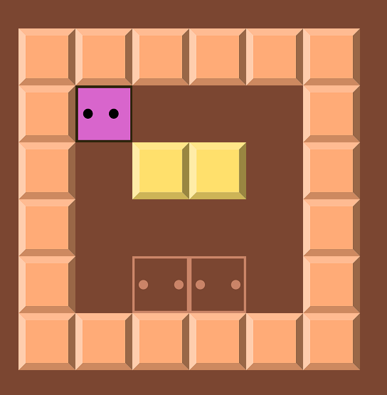

游戏地图为一个$n\times m$的矩形，其中每个格子的种类为：

* 箱子（图中黄色格子）
* 墙（图中橙色格子）
* 目的地（图中棕色、带有两个圆圈的格子）
* “空白格”（图中棕色格子）
* 玩家角色（图中粉色、带有两个圆圈的格子）

在前方没有障碍物（墙、第二个箱子）的前提下，玩家可以通过按下键盘上的`W`、`A`、`S`、`D`来控制角色在空白格内上下左右移动；或者推动相邻格子里的箱子一起移动。如果把所有箱子都推进目的地中，则胜利。更详细的规则可见[维基百科：推箱子](https://zh.wikipedia.org/wiki/%E5%80%89%E5%BA%AB%E7%95%AA)。

### 2、数学问题

1995年，有人证明了推箱子问题是NP-hard的；之后它又被证明是Polynomial Space完全的。


## 三、效果呈现

### 1、游戏主界面

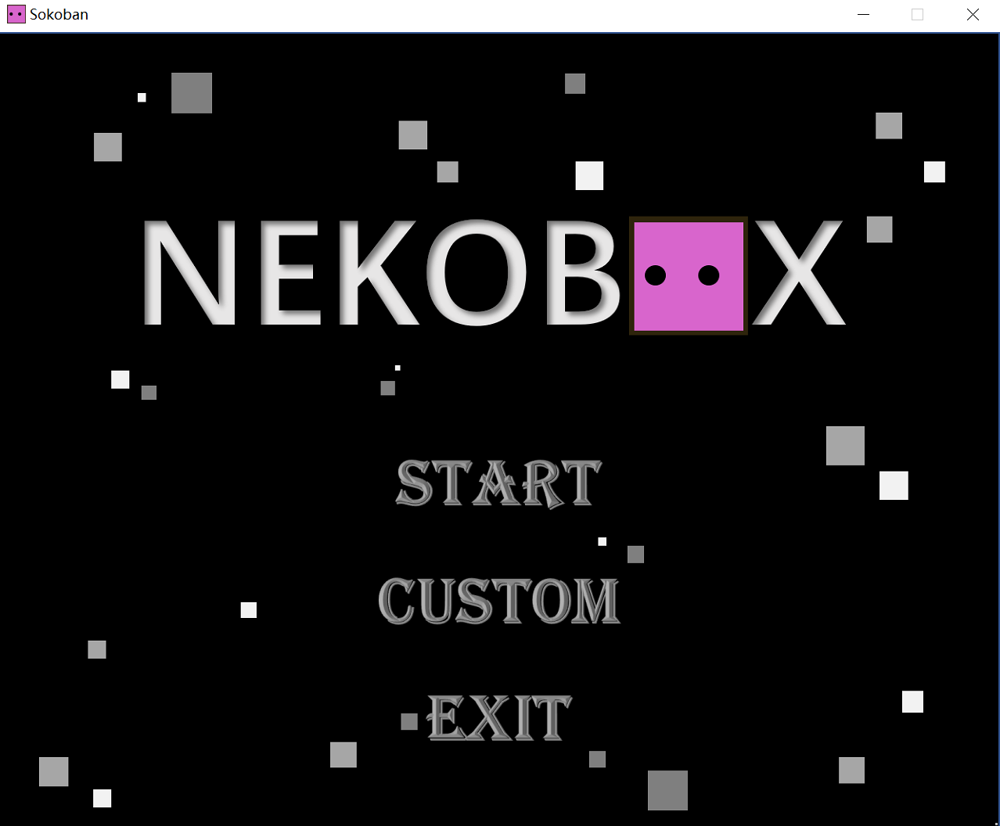

进入游戏主界面后，会自动播放背景音乐。

游戏主界面包括三个主要按钮，各自功能如下：

* START：开始按钮。点击后将进入关卡选择界面。
* CUSTOM：自定义界面。玩家可在此自定义关卡并游玩。
* EXIT：退出程序。

### 2、关卡选择界面

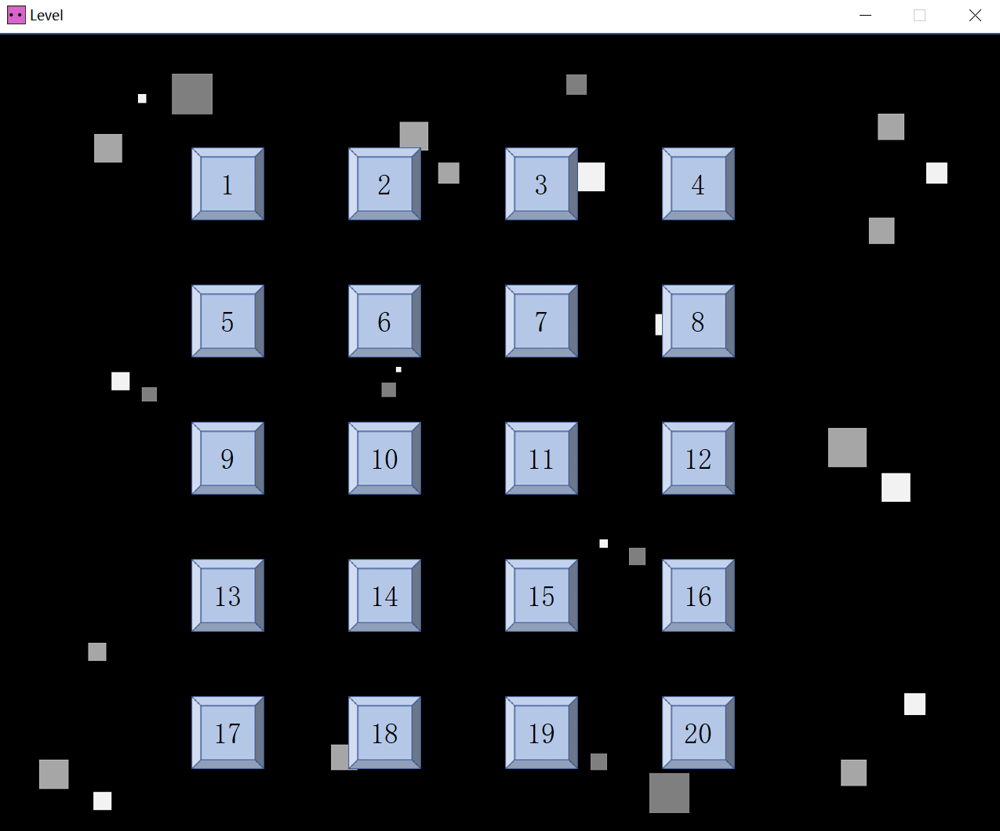

关卡选择界面包含了20个按钮，玩家点击各个按钮即可进入每个关卡游玩。

### 3、游戏界面


此图片展示了最核心的游戏界面。左上角`step:`显示了角色当前移动的步数。

当玩家成功完成当前关卡时，程序会显示“胜利”界面：

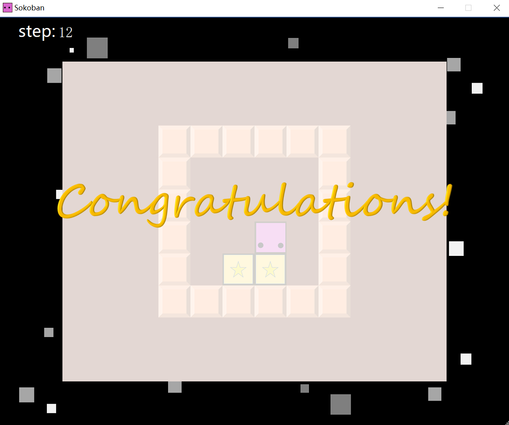

### 4、自定义界面

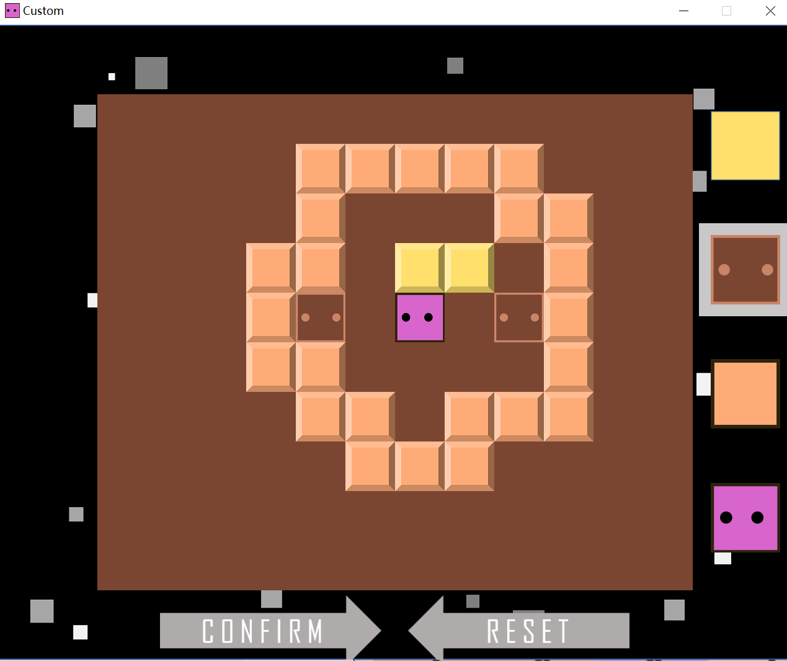

自定义界面中央部分即为游戏地图。右侧四个正方形，依次代表箱子、目的地、墙、角色。玩家可以点击这四个正方形来选取格子类别，然后点击地图区域添加格子、搭建自定义地图。搭建完成后，可以按下界面下方的`CONFIRM`按钮，进入游戏界面。

#### 重置功能

如果玩家对于当前搭建的地图不满意，可以通过三种方式进行重置：

* 全局重置：按下界面下方的`RESET`按钮，整幅地图中填充的格子将被清空。
* 局部重置：对已经搭建好的格子，鼠标右击即可删除该格子上的方块。
* 局部覆盖：在已经搭建好的格子处，选取另一种类的方块后鼠标左击，可将该格子上的方块替换为新的方块。

> 注意：“角色”方块必须**有且仅有**一个。箱子数 = 目标点数 > 0。若没有满足这些条件，将无法`CONFIRM`。
>
> 此外，**请勿**在地图的最外圈放置方块、**请勿**将角色或箱子移动至最外圈，否则会出现越界的问题。在按下`CONFIRM`按钮之后，游戏会自动在最外围填充一圈“墙”，以防止角色或箱子被推出地图外。

### 5、帮助界面

玩家可在游戏界面与自定义界面中按下`H`键查看帮助。

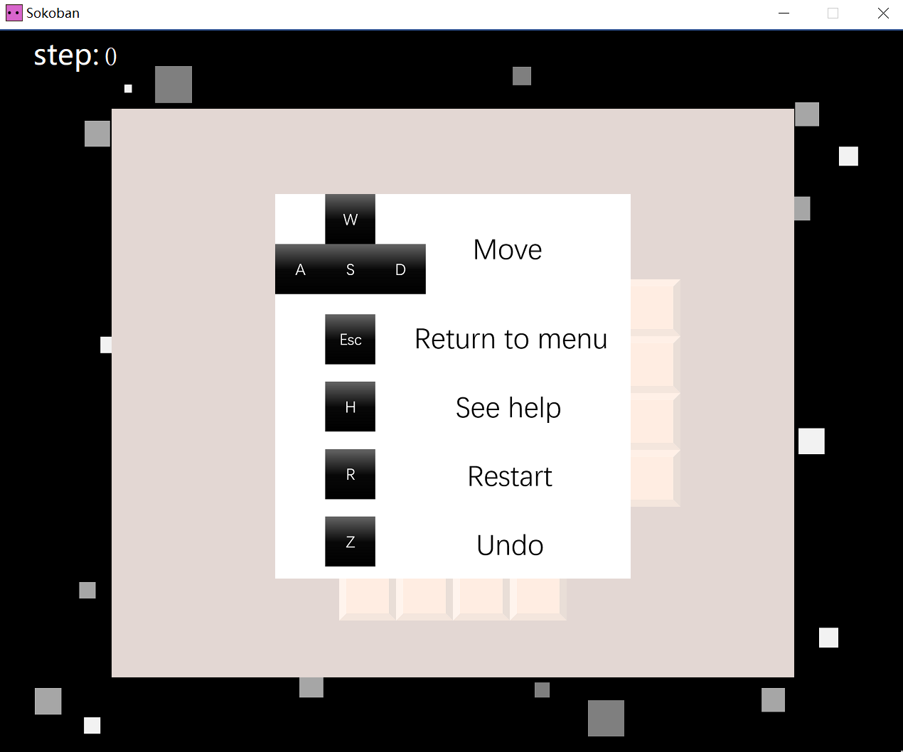

#### 按键功能

如帮助界面所示，该程序支持五大类按键：

* `W`、`S`、`A`、`D`：移动键。分别可以控制角色上、下、左、右移动一格。
* `Escape`键：返回键。按下后会退回到游戏主界面。
* `H`键：帮助键。按下可查看帮助。
* `R`键：重开键。在游戏界面中按下此键，可以重新开始当前关卡或自定义关卡。
* `Z`键：撤销键。在游戏界面中按下此键，可以返回上一步。如果多次按下，可以多次返回、直到最初状态。


## 四、程序构思

### 1、游戏框架

一个良好的游戏框架决定了游戏能否被顺利地写出来、是否易于维护。并且我认为，**后者更加重要**。就“推箱子”程序而言，游戏框架如下所示：

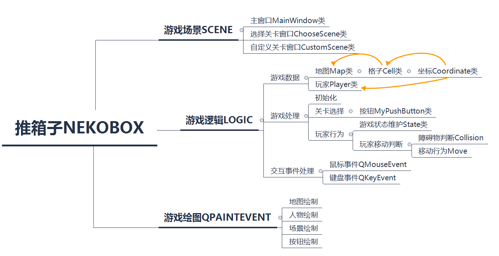

其中需要注意的有这么几点：

* **逻辑和绘图分离**。这样做的好处是：程序有条理、可读性强，且大大降低了游戏逻辑与绘图冲突的可能性。（设想：假如在一个函数里同时囊括游戏逻辑与绘图，那么很可能在绘图的过程中修改了游戏状态（如地图、人物坐标）。如果此时写出了bug，后期维护的时候将十分费劲——因为很难分辨是绘图出错了、还是游戏逻辑出错了。）
* 利用好Qt的**对象树**功能。对象树的意思是说：对象与对象之间存在<u>树状关系</u>。一个父对象可以含有多个子对象，但是一个子对象只能含有一个父对象。<u>当父对象析构时，会自动析构其所含有当所有子对象</u>。基于此功能，在搭建框架的过程中，应当注意对象之间的**继承关系**，这可以有效地避免**内存泄漏**等问题。例如，在本游戏框架里，我自定义的`MyPushButton`类，通过`setParent(this)`函数将`MainWindow`类作为其父亲，从而在析构`MainWindow`的时候，`MyPushButton`也会自动析构——为此，我们不必处处担心子对象指针的`delete`操作。
* 应当指出，游戏框架的构建**未必**是具有前瞻性的——在写代码的过程中，我们会对程序有更深入的了解，从而可能对原有的游戏框架做出某些（甚至是大刀阔斧的）修改。我们不应当过度惧怕代码框架的重构，因为清晰的、耦合性低的架构是极其有利于程序的维护的——在大型项目中，这一优点或许会被展现得更明显。
  * 就本程序而言，我首先做的**只是一个单纯的游戏界面**——先是只有一个可移动的角色，再添加箱子、墙等元素……至于游戏主界面、自定义界面等功能，都是之后才一步步实现的。我认为，这样的编程模式易于上手、容易获得成就感，同时也有利于程序开发人员对程序框架的理解。

### 2、游戏逻辑

> 本部分的目标为：实现一个单一关卡的、粗糙的推箱子游戏。

#### A. 组件

在上述游戏框架的基础上，我们首先定义为了完成游戏逻辑所需要的各项组件。

---

实现这些组件的方式大概有两种：

* 1、让它们继承自`QWidget`，然后在每个子控件中单独完成`paintEvent`、状态维护等功能。
* 2、每个组件只负责维护状态，不负责绘图事件。

两种方法各有利弊：

* 方法1可以直接将子类的实例对象放入主窗口的对象树中，方便构建和析构，也易于信号槽功能的实现。但对于推箱子这类体量较小的游戏而言，这种方法一定程度上不啻为“杀鸡用牛刀”，会加大程序开发的难度。
* 方法2则更加straightforward，在维护完所有状态之后，统一由`MainWindow`类负责绘制。优点是践行了上文所述”逻辑与绘图分离“的原则，但缺点是忽视了各个类间的逻辑关系（例如继承关系），使得后面写的`MainWindow`类中的功能较为杂糅。

考虑到程序规模较小、且开发周期短，我最终选择了第二种方法。

---

##### Coordinate

首先定义最基本的坐标类`Coordinate`：

```cpp
class Coordinate{
public:
	int row;	//行数
    int col;	//列数
    
    int distance(const Coordinate other);	//两个坐标之间的曼哈顿距离
}
```

> 之后，在“推箱子AI初探”部分，会进一步扩充这个类的功能，详见后文。

在此基础上，分别定义格子类`Cell`和玩家类`Player`：

##### Cell

```cpp
enum CellType
{
    WALL,
    TARGET,
    BOX,
    INTARGET,
    EMPTY
};

class Cell{
public:
    //窗口中的相对坐标
	int posX;		
    int posY;
    int width;
    int height;
    
    int cellType;		//格子种类：箱子、墙、目标等
    QPixmap pix;		//贴图
    
    int Row();			//由窗口坐标得到格子在地图中的行数
    int Col();			//由窗口坐标得到格子在地图中的列数
}
```

##### Player

```cpp
class Player{
public:
    //窗口中的相对坐标
    int posX;
    int posY;
    int width;
    int height;
    int face;		//角色的朝向（上、下、左、右）。不同朝向对应的角色贴图不同
    QPixmap pix;
    int step;		//移动步数
    
    int Row();		//获得玩家所在的行/列信息
    int Col();
    void move(int _dRow, int _dCol);	//角色位置移动
    void reset(int _Row, int _Col);		//角色位置重置
}
```

##### Map

在`Cell`类的基础上，我们进一步定义地图类`Map`：

```cpp
class Map{
public:
    Cell Arr[ROW][COLUMN];	//用一个二维数组来维护地图中每个格子的信息
    void InitByFile(std::string filename);	//从文件中读取地图信息
    bool Success();			//判断是否胜利，即：所有箱子是否都被推进了目标点
}
```

> 值得插一句：我一开始把玩家`Player`作为地图的一个成员变量，后来改为分别维护地图类和玩家类。舍弃原先的方法的原因是：该方法不利于代码的解耦，会带来维护上的麻烦。

上述代码的实现均不是很复杂，这里只讲解一下`Map`类的方法`InitByFile(std::string filename)`的实现。

###### 文件读取

假定我们已经知道了文件的相对路径，只需要按行读即可。这里我们没有采取Qt支持的文件读取方式`QFile`以及文件名的字符串表示方法`QString`，而是使用了标准库`std::ifstream`和`std::string`。

```cpp
void Map::InitByFile(std::string filename)
{
    std::ifstream fin(filename);
    for(int y = 0; y < ROW; y++)
    {
        std::string str;
        fin >> str;
        assert(fin);
        assert(str.size() >= COLUMN);
        for(int x = 0; x < COLUMN; x++)
        {
            Arr[y][x].cellType = str[x] - '0';
            Arr[y][x].update();
        }
    }
    fin.close();
}
```

现在，我们有很多的文件（代表不同关卡），只需要**根据关卡数得到相对应的文件名**即可。采用的方法为标准库的**字符串拼接**。

```cpp
std::string filename = "map\\" + std::to_string(chooseScene->level) + ".txt";
map.InitByFile(filename);
```

#### B. 事件

> 本部分讨论基本键盘事件及其派生事件，**不讨论**绘图事件。

##### a. keyPressEvent

首先重写键盘事件。程序需求为：

* 操纵角色上下左右移动
* 支持`Z`键回退功能
* 支持`R`键重开功能
* 支持`H`键查看帮助

于是，键盘事件可以写为：

```cpp
void keyPressEvent(QKeyEvent* event){
    if(event->key() == Qt::Key_H) showHelp = true;	//查看帮助功能。
    if(isGaming){	//只有在游戏的过程中，需要考虑其余按键
        switch(event->key()){
            case Qt::Key_W:
                collision(-1, 0);	//实现角色移动的函数。定义见下文。
                break;
            case Qt::Key_A:
                collision(0, -1);
                break;
            case Qt::Key_S:
                collision(1, 0);
                break;
            case Qt::Key_D:
                collision(0, 1);
                break;
            case Qt::Key_Z:
                this->callback();	//实现撤销功能的函数。定义见下文
            	break;
            case Qt::Key_R:
                this->set();		//实现重开的函数。定义见下文。
                break;
        }
    }
    this->update();		//每次按下键盘，都需要更新绘图
}
```

注意：对`H`键的键盘按下事件，需要再重写键盘松开事件来完善其功能：松开`H`，不再显示图片。

接下来，单独写一个`logic.cpp`文件，定义上面的三个还没写的函数：

##### b. collision

`collision(int, int)`函数模拟了上下左右移动人物的情形。如果角色前方有箱子，需要判断箱子能否被推动。

我参考了[该视频](https://www.bilibili.com/video/BV1Wq4y177MT)。

```cpp
void collision(int _dRow, int _dCol)	
//参数表示玩家下一步即将到达的位置与当前位置间的横纵坐标差值
{
    //记录玩家当前所在位置以及朝向
    int nowRow = player.Row();
    int nowCol = player.Col();
    int nowFace = player.face;

    //玩家下一时刻即将到达的位置
    int newRow = nowRow + _dRow;
    int newCol = nowCol + _dCol;
    auto& cell = map.Arr[newRow][newCol];
    auto& next_cell = map.Arr[newRow + _dRow][newCol + _dCol];

    if(cell.cellType == CellType::WALL) return;	//如果被墙阻挡，将无法移动
    else if(cell.cellType == CellType::BOX)		//如果前面是箱子，尝试推它
    {
        //如果箱子前面没有障碍物，或者是目标点，则可以移动；其余情况不能推动箱子
        if(next_cell.cellType == CellType::EMPTY)
        {
            cell.cellType = CellType::EMPTY;
            next_cell.cellType = CellType::BOX;
            player.move(_dRow, _dCol);
        }
        else if(next_cell.cellType == CellType::TARGET)
        {
            cell.cellType = CellType::EMPTY;
            next_cell.cellType = CellType::INTARGET;
            player.move(_dRow, _dCol);
        }
    }
    else if(cell.cellType == CellType::INTARGET)
    {
        //如果箱子前面没有障碍物，或者是目标点，则可以移动；其余情况不能推动箱子
        if(next_cell.cellType == CellType::EMPTY)
        {
            cell.cellType = CellType::TARGET;
            next_cell.cellType = CellType::BOX;
            player.move(_dRow, _dCol);
        }
        else if(next_cell.cellType == CellType::TARGET)
        {
            cell.cellType = CellType::TARGET;
            next_cell.cellType = CellType::INTARGET;
            player.move(_dRow, _dCol);
        }
    }
    else player.move(_dRow, _dCol);		//玩家面前没有障碍物，可直接移动
} 
```

其中采用C++关键字`auto`来进行类型推导。下面是关于`auto`的用法中容易出错的地方：

正确的写法为`auto& Cell = map.Arr[newRow][newCol]`，而不是`auto Cell = map.Arr[newRol][newCol]`。首先，由于我们需要对地图做出修改，所以必须传**引用**而非传值。其次，**`auto`关键字不会自动推导出引用**，所以必须写为`auto&`。

##### c. set

`set()`函数负责地图和人物信息的重置，从而实现`R`键的功能。

简单的实现思路为：在初始化之时就拷贝一份地图和人物，记为`origin_map`和`origin_player`，在`set`函数中，直接传入这两个数据即可。

```cpp
void set()
{
    //更新地图信息
    for(int i = 0; i < ROW; i++)
    {
        for(int j = 0; j < COLUMN; j++)
        {
            map.Arr[i][j].cellType = origin_map.Arr[i][j].cellType;
            map.Arr[i][j].update();
        }
    }
    //更新玩家信息
    player = origin_player;
}
```

##### d. callback（重点）

`callback`函数负责实现`Z`键的功能：撤销。

我认为，该部分是本程序中属于比较精彩的内容。因此我下文将采用Q&A的形式，向读者原原本本地展现我在处理该问题时的每一步思路。

---

###### Q1: 维护哪些状态？

由于可能出现多次撤销的情况，需要维护每一时刻的状态——包括玩家和地图。

首先思考：需要维护哪些状态？事实上，由于推箱子游戏的进程是**可逆**的，而玩家的实质操作仅仅是`WASD`四个按键，所以我们在逆过程（可以理解为”拉箱子“）中也只需要维护`WASD`按键的**时序**数据——真的如此吗？

考虑如下两种情形：（我们记从左到右相邻的三个位置为A, B, C）

* 玩家在A处，箱子在B处，而C处为空地。玩家向右推动箱子，效果为：空地 | 玩家 | 箱子
* 玩家在A处，箱子在C处，而B处为空地。玩家向右推动箱子，效果为：空地 | 玩家 | 箱子

可以发现，在两种情形里，玩家执行的操作都是”向右移动“，最终达到的状态也都一样；但这两种情形的初始状态是不一样的。换言之，**仅仅维护`WASD`的时序数据是不够的。**

当然，正确维护状态的方法很多，例如Brute Force：维护每一时刻地图、玩家的全部信息。考虑到地图大小为$12\times 10$，而玩家的步数`step`可能达到上百甚至上千，所以这种方法是”空间不友好“的。如何改进呢？

事实上，**维护玩家信息就够了**——其实，只需维护玩家每一步的坐标、以及它是否推了箱子这**两个参数**即可！不难证明，地图的变换完全可以由这两个参数推断出来；而玩家的状态中可能发生变化的，只有坐标和朝向——其中”朝向“也是可以由前后两个时刻的坐标推断出来的。

但是，为了方便起见，我还是**单独维护了玩家的朝向**。这样会使代码更简洁易懂，也不会占用太多的内存空间。

```cpp
class State
{
public:
    Coordinate pos;	//玩家的位置
    bool isPush;	//玩家这一时刻是否推了箱子
    int face;		//玩家朝向
}
```

---

###### Q2: 用何种数据结构管理这些状态？

我们考虑问题的需求：抽象地看，用户无非在做两件事情——1、每次移动，就新增一个状态；2、每次撤销，就弹出一个状态，并在它提供的数据上做一些处理。所以说，一共就两个接口：`push()`、`pop()`。

并且，我们发现：状态是具有”先进后出“的规律的——我们最先弹出的，恰恰是最后加入的状态。这种性质让我们想到了”**栈**“(Stack)的数据结构。

---

###### Q3: 如何具体实现该函数？

首先，对上面的代码做一些必要的补充。定义状态栈`QStack<State> state`。在`collision`函数里，如果玩家移动了，就把玩家在后一时刻的状态入栈：`state.push(State(nowRow, nowCol, isPush, nowFace));`。在`set`函数里，同样进行修改：每次重置的时候，都需要把栈清空，并重新初始化：

```cpp
state.clear();
state.push(State(player, false));
```

接下来实现撤销函数`callback()`。

```cpp
void callback()
{
    if(state.size() <= 1) return;	//状态数为1表示初始状态；状态数为0表示当前没有状态。均直接返回
    State last_state = state.pop();	//弹出栈顶状态

    //更新人物状态
    int now_face = player.face;
    Coordinate now_pos = Coordinate(player.Row(), player.Col());
    player.face = last_state.face;
    player.posX = last_state.pos.col * length + leftMargin;
    player.posY = last_state.pos.row * length + topMargin;
    player.step--;		//记得把人物的步数-1

    //如果推了箱子，就更新箱子状态
    if(!last_state.isPush) return;
    int _dRow = 0; int _dCol = 0;   //箱子相对于人物的位置
    switch(now_face)
    {
    case Face::UP:
        _dRow = -1;
        break;
    case Face::DOWN:
        _dRow = 1;
        break;
    case Face::LEFT:
        _dCol = -1;
        break;
    case Face::RIGHT:
        _dCol = 1;
        break;
    }
    //玩家面对的位置
    Cell& facing_cell = map.Arr[now_pos.row + _dRow][now_pos.col + _dCol];
    //玩家当前所在的位置
    Cell& cur_cell = map.Arr[now_pos.row][now_pos.col];

    //下面代码的思路和collision函数类似
    if(facing_cell.cellType == CellType::BOX)
    {
        facing_cell.cellType = CellType::EMPTY;
        cur_cell.cellType = (cur_cell.cellType == CellType::EMPTY) ?
            CellType::BOX : CellType::INTARGET;
    }
    else if(facing_cell.cellType == CellType::INTARGET)
    {
        facing_cell.cellType = CellType::TARGET;
        cur_cell.cellType = (cur_cell.cellType == CellType::EMPTY) ?
            CellType::BOX : CellType::INTARGET;
    }
}
```

至此，游戏逻辑基本实现。我们尚未涉及图形渲染等功能，但感兴趣的读者已经可以在上文的基础上实现一个简单的**控制台推箱子程序**。

### 3、用户界面(UI)

这部分主要介绍两个内容：窗口类的用户逻辑、窗口类的绘图。

为此，我们需要先定义三个窗口类`MainWindow`、`CustomScene`以及`ChooseScene`。

关于这部分内容，我参考了[该视频](https://www.bilibili.com/video/BV1g4411H78N)。

---

#### A. 窗口（场景）类

##### a. 主窗口类

主窗口类的定义如下。其中某些成员变量及成员函数的含义已经在上文指出。

```cpp
class MainWindow : public QMainWindow
{
	Q_OBJECT
public:
    MainWindow(QWidget *parent = nullptr);
    ~MainWindow();
    
protected:
    void paintEvent(QPaintEvent*);
    void keyPressEvent(QKeyEvent* event);
    void keyReleaseEvent(QKeyEvent* event);

private:
    Ui::MainWindow *ui;
    Player player;
    Map map;

    //拷贝人物和地图，用于重开'R'操作
    Player origin_player;
    Map origin_map;

    //维护每一时刻状态的栈，用于撤销'Z'操作
    QStack<State> state;

    //资源文件载入
    QPixmap help;   	//帮助界面的图片
    QPixmap background; //背景图片
    QPixmap congrat;    //胜利图片

    //按钮
    MyPushButton* startBtn = nullptr;
    MyPushButton* customBtn = nullptr;
    MyPushButton* exitBtn = nullptr;

    //布尔值
    bool tabPressedDown = false;    //是否按下H键
    bool isGaming = false;          //是否正在游戏中
    bool isCustom = false;          //是否正在自定义设计关卡
    bool isChoosing = false;        //是否正在选择关卡
    bool success = false;           //是否胜利

    //场景
    CustomScene* customScene = nullptr;
    ChooseScene* chooseScene = nullptr;

    //游戏逻辑
    void collision(int _dRow, int _dCol);
    void set();             //重置当前关卡
    void callback();        //回退到上一次的状态
    void chooseLevel();     //按下“开始”按钮后的界面操作
    void startGame();       //开始进入游戏界面
    void copy();            //拷贝人物和地图
    void initGame();        //游戏界面初始化
    void returnToMenu();    //回到菜单界面

    //绘图函数
    void gamePaintEvent(QPainter* painter);

    //用于显示当前步数的label
    QLabel* label;
}
```

可见，`MainWindow`类的定义较为繁琐，这也是我在上文”组件“部分里选择”方法2“的弊端。

##### b. 自定义关卡窗口类

```cpp
class CustomScene : public QMainWindow
{
    Q_OBJECT
public:
    explicit CustomScene(QWidget *parent = nullptr);
    
    //逻辑函数
    int getCellType(int customType);
    void reset();

    //玩家
    Player player;
    bool playerExist = false;   //玩家是否已经被添加了

    //地图
    Map customMap;

protected:
    void paintEvent(QPaintEvent*);
    void mousePressEvent(QMouseEvent*);
    void keyPressEvent(QKeyEvent*);
    void keyReleaseEvent(QKeyEvent*);

private:

    //按钮
    MyPushButton* boxBtn = nullptr;
    MyPushButton* wallBtn = nullptr;
    MyPushButton* playerBtn = nullptr;
    MyPushButton* targetBtn = nullptr;
    MyPushButton* checkBtn = nullptr; //确认按钮
    MyPushButton* resetBtn = nullptr; //重置按钮

    //图片
    QPixmap pix_box;
    QPixmap pix_wall;
    QPixmap pix_target;
    QPixmap help;
    QPixmap background;

    //鼠标
    QCursor cursor;

    //选择的格子种类
    int customType = CustomType::empty;

    //帮助界面
    bool showHelp = false;
    
    //自定义地图是否合法
    bool map_legal();

signals:
    void customCheck(); //确认完成自定义的信号
};
```

##### c. 选择关卡类

```cpp
class ChooseScene : public QMainWindow
{
    Q_OBJECT
public:
    explicit ChooseScene(QWidget *parent = nullptr);
    int level = -1;         //第几关

protected:
    void paintEvent(QPaintEvent*);
    void keyPressEvent(QKeyEvent*);

private:
    QPixmap background;

signals:
    void startGame();
    void returnToMenu();
};
```

#### B. 场景间的切换关系

`MainWindow`类可以看作本程序的主窗口；而其余两个窗口类可以看作副窗口——我将它们都写成了主窗口的成员变量，以强调这一观点——尽管这样的写法其实并非必要的。场景与场景之间的切换关系可以用下图来形象地阐释。我们也可以在此基础上，利用Qt强大的**信号槽**机制，高效地实现这些功能。

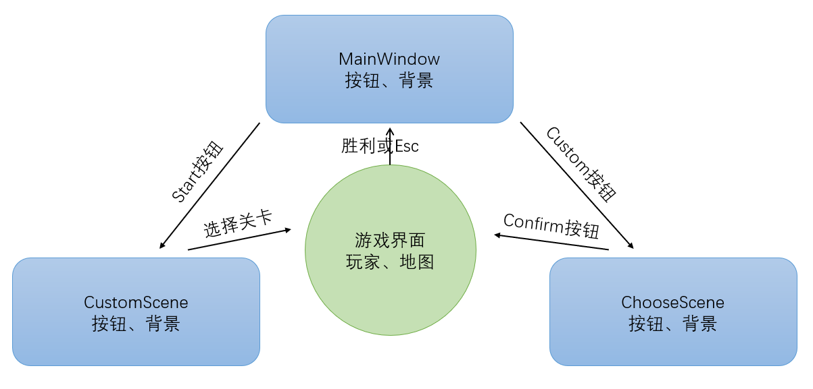

#### C. 绘图函数

##### a. 组件状态更新

这里所说的“组件”和“游戏逻辑”中的组件并不一样——我们指的是与用户界面相关、与游戏本身的逻辑并不直接相关的组件，例如按钮、帮助界面。“组件状态更新”，指的是玩家进行某些操作（例如按下按钮、按键）后，这些组件发生的变化、以及我们是如何维护这些变化的。

组件状态的更新有两种方法：1、通过信号槽机制实时监听并完成更新；2、通过自定义的键盘或鼠标事件更新。

---

###### 信号槽与Lambda表达式

对于Qt按钮类`QPushButton`，我们可以方便地利用信号槽机制监听按钮的按下情况：

```cpp
connect(someBtn, &QPushButton:clicked, [&](){
    this->do_something;
})
```

其中用到了C++特性：Lambda表达式。关于Lambda表达式的介绍可以参考[cppreference-Lambda表达式](https://zh.cppreference.com/w/cpp/language/lambda)。

Lambda表达式可以看成一个匿名函数，其基本用法为：[捕获] + (形参) + {函数体}。其中，在执行函数体时，若访问变量，则只能访问其被捕获的副本（对于以复制捕获的实体）或原对象（对于以引用捕获的实体）。如果“捕获”写为[&]，则是以引用隐式捕获；如果写为[=]，则是以复制隐式捕获。

在本文讨论的案例中，由于函数体内需要执行this的一些成员函数，或修改this的一些成员变量，所以选择[&]的引用隐式捕获形式。

cppreference中写道：当出现任一默认捕获符时，都能隐式捕获当前对象`*this`。若隐式捕获它，则始终以引用捕获，即使默认捕获符是 `=`。<u>**当默认表示符为`=`时，`*this`的隐式捕获被弃用。(C++20起)**</u>

因此，在C++20之前，写成[=]也同样可以以引用的形式捕获`*this`，但C++20起就不能这么做了。**读者应当格外注意这一改动。**事实上，<u>在我学习Qt信号槽时参考的[视频](https://www.bilibili.com/video/BV1g4411H78N?p=14)中，讲解人也使用了[=]来达到引用捕获`*this`的目的，自C++20起这是不正确的。</u>

---

###### 鼠标/键盘事件

由于`QMainWindow`会自动监听`QKeyEvent`与`QMouseEvent`，所以该方法本质上与信号槽机制是类似的。只需在重载的`keyPressEvent`与`keyMouseEvent`中添加一些新的语句即可，例子如下。

```cpp
void CustomScene::keyPressEvent(QKeyEvent *event)
{
    if(event->key() == Qt::Key_H)
    {
        showHelp = true;
    }
    this->update();
}

void CustomScene::keyReleaseEvent(QKeyEvent *event)
{
    if(event->key() == Qt::Key_H)
    {
        showHelp = false;
    }
    this->update();
}
```

此例中，我们实现的功能为：按下`H`键显示帮助界面，松开后隐藏。因此需要同时重载`keyPressEvent`和`keyReleaseEvent`，用类的成员变量`(bool)showHelp`来表示是否显示帮助界面。在完成`keyEvent`之后，记得更新（`this->update()`），否则程序不会自动重新调用`paintEvent`函数。

##### b. 组件绘制方法

组件的绘制方法可分为两类：

* 1、图片QPixmap、图形QRect等，在`paintEvent`函数内绘制；
* 2、`QPushButton`、`QLabel`等继承自`QWidget`的控件，可直接通过`show()`和`hide()`函数简单地完成绘制。

我们分别展示一例。

###### 例一：QPaintEvent

```cpp
void CustomScene::paintEvent(QPaintEvent*)
{
    QPainter painter(this);
    
    //draw background begins here
    painter.drawPixmap(0, 0, 1280, 1024, background);
    //draw background ends here

    //draw map begins here
    for(int i = 0; i < ROW; i++)
    {
        for(int j = 0; j < COLUMN; j++)
        {
            Cell curCell = customMap.Arr[i][j];
            QPixmap pix = curCell.pix;
            painter.drawPixmap(curCell.posX, curCell.posY, length, length, pix);
        }
    }
    //draw map ends here

    //draw player begins here
    if(playerExist)
    {
        painter.drawPixmap(player.posX, player.posY, 
        	player.width, player.height, player.pix);
    }
    //draw player ends here

    //draw rectangle begins here
    //在选定一个方块后，在其上面画一个矩形，以显示“当前选择的是该种方块”
    QRect rect;
    switch(customType)
    {
    case CustomType::box:
        rect = QRect(1130, 120, 150, 150);
        break;
    case CustomType::wall:
        rect = QRect(1130, 520, 150, 150);
        break;
    case CustomType::player:
        rect = QRect(1130, 720, 150, 150);
        break;
    case CustomType::target:
        rect = QRect(1130, 320, 150, 150);
        break;
    default:
        break;
    }
    painter.fillRect(rect, QBrush(QColor(255, 255, 255, 200)));
    //draw rectangle ends here

    //draw "help" begins here
    //帮助界面应该是最顶层的，需要最后绘制
    if(showHelp)
    {
        //先画半透明矩形遮罩，可通过修改颜色的alpha值达到半透明效果
        painter.fillRect(QRect(leftMargin, topMargin, COLUMN * length, ROW * length), 				QBrush(QColor(255, 255, 255, 200)));
        //再画帮助界面图像
        painter.drawPixmap((this->width() - help.width()) / 2, 232, help);
    }
    //draw "help" ends here
}
```

###### 例二：QWidget控件

下面展示的是：在游戏界面左上角，显示玩家**当前移动步数**。我们通过控件`QLabel`达到显示文字的效果。

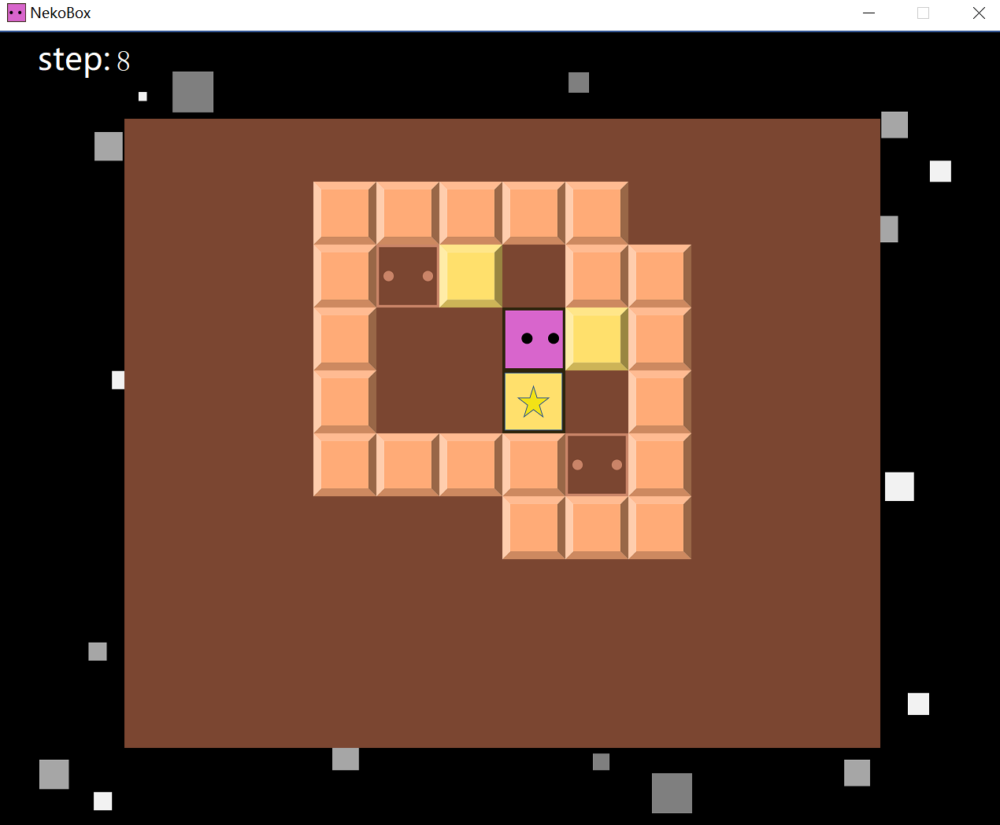

```cpp
QLabel* label = new QLabel;
label->setParent(this);		//将label放在对象树中
label->setText(QString::number(player.step));	//设置文字：通过QString的类型转换函数number()
QPalette pe;		//设置样式
pe.setColor(QPalette::WindowText, Qt::white);
label->setPalette(pe);
QFont font;			//设置字体
font.setPointSize(18);
label->setFont(font);
label->move(150, -202);		//移动位置
```

至此，NekoBox游戏大体上已经开发完成！


## 五、推箱子AI初探

当然，我们不会仅仅满足于此。一个很自然的想法是：能否设计一个自动解推箱子问题的程序？

在[推箱子wiki](http://sokobano.de/wiki/index.php?title=Solver_Statistics)上，这个问题已经得到了一定的讨论。现有的、优秀的推箱子解决方案(Sokoban Solver)可以在[这里](http://sokobano.de/wiki/index.php?title=Links#Sokoban_Solvers)找到。我们暂时无法奢求写出能与它们媲美的算法，因此只讨论一些基本的问题。感兴趣的读者也可以在本文的基础上做进一步的探索。

> 由于该部分不涉及用户界面，只是对抽象的地图做处理，所以我没有继续使用Qt Creator完成本部分内容。
>
> 集成开发环境：Visual Studio Community 2019，版本16.11.11
>
> 这部分代码见Sokolution文件夹。

### 思路和算法：寻路

注意到：”推箱子“问题和”**迷宫(maze)**“问题有很大的相似之处：它们都是**操纵人物、将目标”移动“至目的地**。只不过，在迷宫游戏中，”目标“就是玩家自己；而在推箱子游戏中，”目标“是所有的箱子。为此，我们可以尝试将迷宫问题的常见解法迁移运用到推箱子的游戏中。

迷宫游戏最常见的方法就是**寻路算法**——例如BFS、DFS、Dijkstra、AStar。我采用的是AStar算法，该算法最初发明之际的论文在[这里](https://scholar.google.com/citations?view_op=view_citation&hl=zh-CN&user=EmP8sFQAAAAJ&citation_for_view=EmP8sFQAAAAJ:2osOgNQ5qMEC)。

我认为有必要在本文中回顾一下AStar算法的发展历史，因为这有助于我们加深对推箱子中该方法的迁移的理解。

#### BFS

BFS(Breadth First Search)，中文名为广度优先搜索，几乎是最原始、最根本的图论寻路算法之一。该方法的大致思路为：维护一个数据结构（例如**双端队列**`deque`），首先压入起点，再依次遍历起点的邻近点、将它们压入队中，然后再遍历已经遍历过的点的**邻近**的点（类似游戏Minecraft中，水/岩浆的流动规则），直到找到终点为止。此时，再**回溯**每个节点直至根节点即可。

广度优先搜索的确可以找到一条路径，但它**未必是最优的**。而Dijkstra算法则较好地解决了这个问题。

#### Dijkstra

邓俊辉老师在《数据结构》课上曾经提到过这么一个观点：无论是BFS、DFS抑或Dijkstra等等，其实都可以认为是”PFS“——**Priority** First Search。其实，这些算法的总体框架都是”遍历“，唯一的区别就是：在搜完某个点之后，下一个搜谁？对BFS而言，是搜`deque`中的尾部元素；对DFS而言，是搜当前节点的”儿子“节点——也就是与它相邻的节点。而对Dijkstra而言，搜的是**距离起点最近的**、还没有被搜的点——”先搜谁“的问题，不就是我们如何定义Priority的问题吗？

具体地，对Dijkstra算法来讲，我们需要额外维护每个节点到起点的**距离**——至于是曼哈顿距离（即采用L1范数），还是欧几里得距离（L2范数），或者其它的距离，就取决于问题本身了。

为了取出距离最近的点，很自然的想法是把所有点按距离顺序**排序**，然后取出头部元素即可。抽象地看，我们大概需要对这个数据结构进行两种操作：任意位置插入、首位置删除，并且每次操作后都能维护**最小**元素。**完全二叉堆**可以很好地解决这个问题——与常见的平衡搜索树不同，二叉堆并不维护**全序关系**，而是维护了一种**偏序**关系，而我们所需要的，恰恰就**只是**最小的元素。

#### Best First Search

类比Dijkstra，我们想：能否计算每个点到终点的距离，然后每次遍历都以**该距离最小者**为优先？这就是Best First Search（中文名”最佳优先搜索“）的idea。可惜的是，我们往往并不能很好地计算出该距离。例如现实生活中的例子：河两岸的两点，直线距离很短，但想要从一点到达一点，人们可能需要走很远的路、上桥、再走很远的路才行。**如何有效地避开路径中的“障碍”呢？**

#### AStar

A*算法，本质上就是综合了Dijkstra和Best First的想法而产生的。**不同之处仍然是优先级Priority的定义**。AStar算法中，优先级用函数$f(x)$刻画：$f(x)=g(x)+h(x)$。其中$g(x)$为当前点到起点的距离；$h(x)$为当前点到终点的“预估距离”——如上文所述，这个距离是难以被准确计算的，只能看成是一个**启发式(heuristic)函数**。唯一的问题就是：**如何估算$h(x)$？**

* 如果$h(x)\equiv 0$，该算法就退化成了Dijkstra算法。

* $h(x)$可以定义成：（不考虑障碍物时）当前点到终点的距离，乘以**比例系数**。比例系数的选取，对搜索的**时间成本**和**准确度**都会带来影响。

在此基础上，我们就可以思考：如何把朴素的寻路算法迁移到推箱子中？

### 实现

#### 点（坐标）

首先，不失一般性地，可以在前面定义的坐标类`Coordinate`的基础上对**运算符**进行**重载**——也就是定义二维**线性空间**上的加减法、数乘、赋值、比较……此外，如上文所述，需要定义两点间的距离函数——在推箱子游戏中，人物只能上下左右移动，所以选取**曼哈顿距离**是最合适的。

#### 迷宫寻路

具体到上文所述的AStar算法的实现细节，下面的伪代码可供参考：

首先需要维护一个集合open_set（用标准库中的`set`就行，因为它在`insert`时会自动排序——标准库中对`set`的实现方法好像是红黑树），来存储已经”探寻“到、并且等待遍历的所有节点。其次对地图上的每个点打上标记：已经遍历过的，记为CLOSED；在集合中等待遍历的，记为OPEN；否则不标记。

* 初始化：将起点加入open_set中
* 如果open_set不为空，就选取优先级最高（$f(x)$最小）的节点：
  * 如果就是终点，则：
    * 从该点开始回溯至起点
    * 返回成功
  * 如果不是终点：
    * 将该点从open_set中删除，并标记为CLOSED
    * 遍历它的所有邻居：
      * 如果还没有被打上标记：
        * 将它的父亲设为当前节点
        * 计算它的优先级，将它加入open_set中，并打上OPEN标记

* 返回失败

#### 推箱子寻路

其实，上面讨论的这些寻路算法，无非是在**穷举**。穷举的结果只有两个，要么找到终点；要么失败。如果想明白了这一点，就会发现推箱子的寻路算法其实和迷宫是如出一辙的——当然，需要考虑的特殊情况会更多一些；此外，为了减少遍历次数，我们可以在某些情况下进行**剪枝**。

##### a. $h(x)$？

第一个问题就是启发式函数$h(x)$的选取。这其实和我们最终想要达成的目标有关。简单地考虑，$h(x)$可能取决于两个因素：1、所有箱子到所有目的地的距离之和；2、当前点到所有箱子的距离之和。

##### b. 剪枝1：死路

死路，顾名思义就是：玩家无法推动前方的箱子，因为它被”卡死“了。一种典型的情况就是箱子被卡在了墙角，动弹不得。对这种情况，可以提前加以检测。这其实和”游戏逻辑“部分讨论的`collision`函数是不谋而合的。

##### c. 剪枝2：循环

可能出现这么一种情形：玩家先将箱子从A地推到了B地，又将它从B地推到了A地。如果不仔细思考的话，可能会认为这样的行为是不应被允许的——它们会被看作同一种”状态“。然而，**所有箱子在地图上的位置相同时，游戏的状态一定相同吗？**

这其实是不正确的。因为我们还没有考虑**玩家的位置**。当且仅当玩家前后所在的A点和B点**连通**的情况下，我们可以认为这两种状态是完全相同的。至于如何判断两点是否连通？**迷宫寻路算法**就在这个时候派上用场了！

> 注：我玩过的很多难度较大的推箱子关卡，都需要利用到这种看似是”循环“、实际不是循环的解决方案。足见其重要性。

##### d. 状态

像上面所说的，每次遍历都需要判断该点对应的状态是否已经出现过了，也就是需要将它和之前的状态集中的每一个状态逐一比照，而每次比照都需要遍历地图数组的每一个位置——很繁琐。维护状态的一个讨巧的办法是利用**散列**(hash)的性质，对每一种状态，按照某种规则转化成字符串，然后进行**字符串哈希**。接下来，对即将遍历的新状态，只需要判断它在哈希表中是否与已有元素冲突就行了。

##### e. 剪枝3：配对

其实，在特定的情况下，我们可以**断言**：某个箱子一定对应于某处的目标点。比如：如果一个箱子是靠着一排墙的，那它必然不能被推离墙边，于是它最终的“归宿”一定也是**靠墙的某个目标点**。我们可以照此把箱子和目标点进行**两两配对**。如果存在一个箱子，不和任何目标点配对，那么这种状态一定是不可行的。

### 展望

以上讨论并不复杂，并且网络上已经有很多更先进、更精妙的算法来解决推箱子问题了，但它们并不在本次作业的讨论范围内。感兴趣的读者可以思考：1、还有哪些特殊状态是可以通过简单的判断来剪枝的？（[这篇论文](https://core.ac.uk/download/pdf/82273659.pdf)里就讨论了tunnel、cut等情况）；2、除了朴素的穷举、遍历算法，是否还有其它的方法？


## 六、经验总结

在完成该项目的过程中，我遇到了许多问题，也在一一解决它们的过程中锻炼了自己的编程能力与debug能力，故选取一些代表性的内容记录在此。

---

### 关于美工

好看的图像、动画等，是一个游戏必不可少的组成部分。但是，在独立开发小型游戏项目的过程中，开发者需要同时包揽游戏逻辑开发和UI设计，难免力不从心。在我上学期完成大作业的过程中，就试图兼顾二者，结果因为**设计之初缺乏总体构思**，导致UI设计上花费了大量精力。但此次编程过程中，我首先将所有的按钮、格子等都抽象为一个简单图形（如下图所示），等到完成游戏逻辑开发之后再对其加工美化，大大缩减了开发时间。

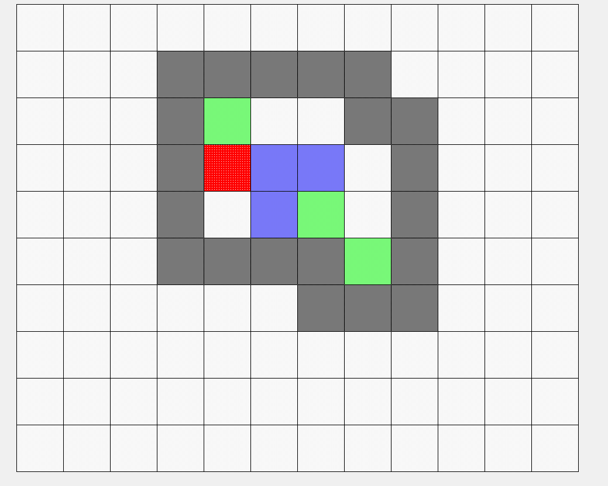

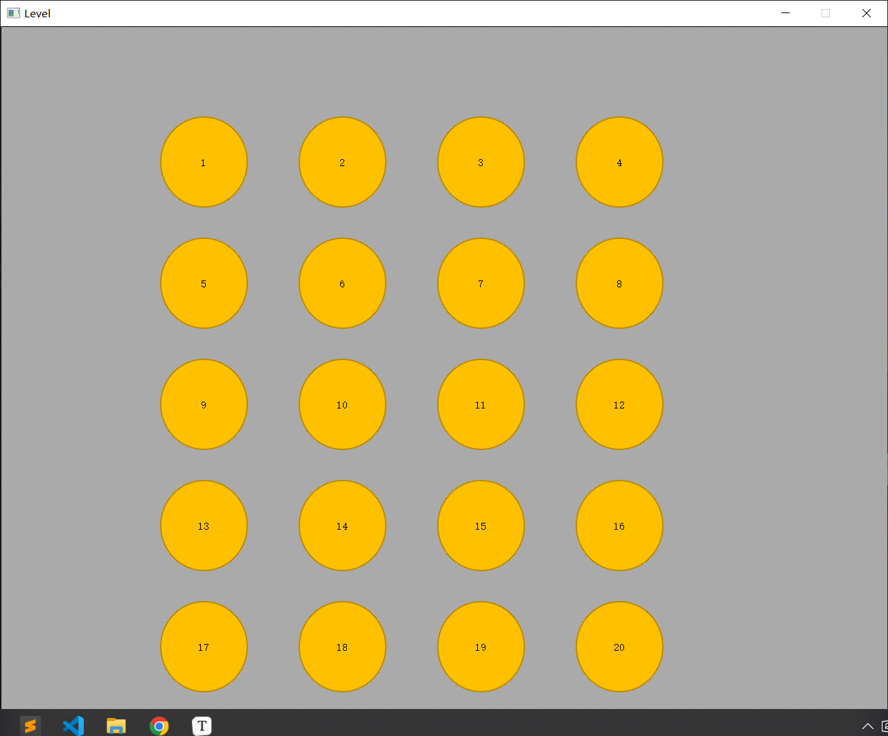

---

### 关于逻辑(logic)与绘图(paint)的权衡

游戏逻辑与游戏绘图，正如上文所言，都是很重要的。上文提到：完成游戏逻辑设计之后，读者已经可以完全自行设计出一个控制台推箱子程序了，但我实际上并没有这么做。我认为，**逻辑与绘图是相辅相成的**。一方面，一个初具雏形的图形界面更能帮助我们直观地找到可能的bug，同时也能启发我们对游戏逻辑的新的理解——例如，我在实现`Z`键撤销功能时，就依靠图形界面对需求做了更全面的分析。另一方面，如果没有游戏逻辑的支撑，又谈何绘图呢？

---

### 开发日志

在写程序的某一天，我突然想到写一些开发日志来记录每天实现的功能、以及想到但还没落实的idea。如下图所示：

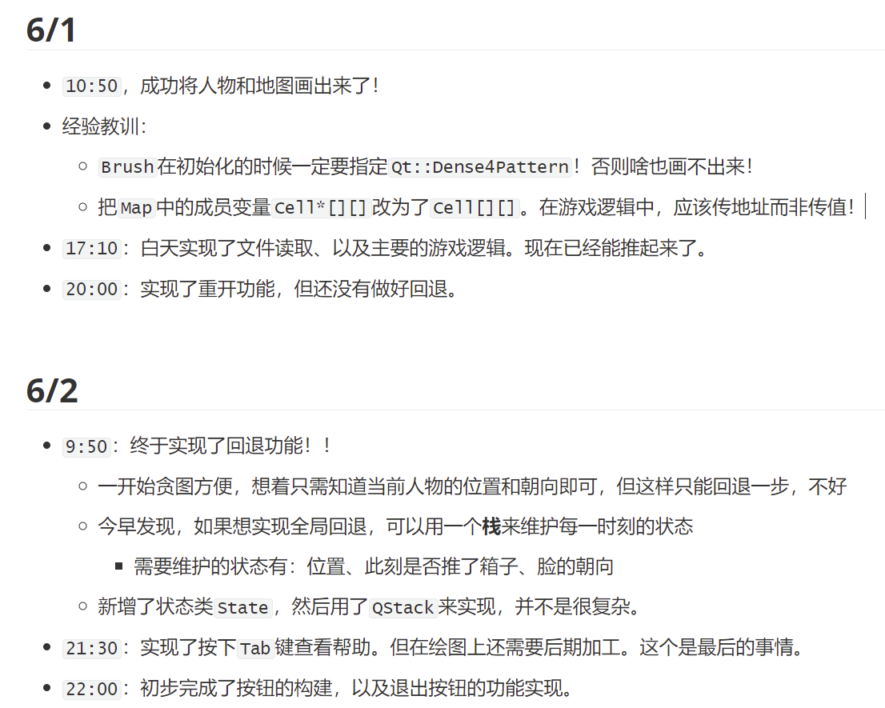

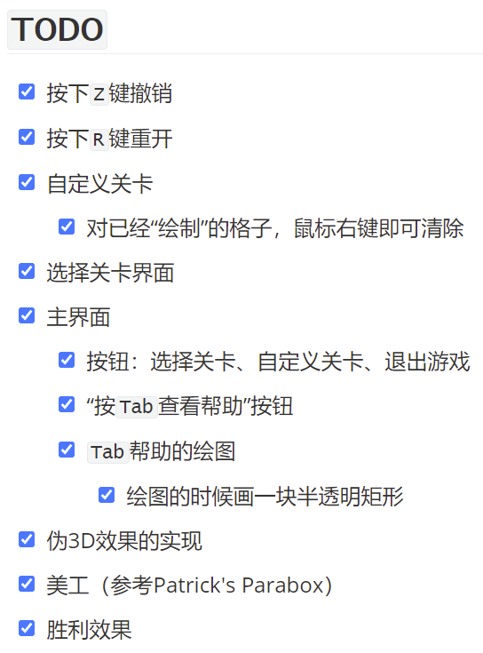

我发现，在维护开发日志之后，我的编程效率得到了很大的提升——每当在TODO-list中勾掉一项，我都能获得一定的**成就感**，起到了很大的激励作用。


## 七、游戏测试

测试视频见test文件夹，其中既包含了游戏功能的测试，也详细介绍了游戏玩法。


## 八、参考资料

* 游戏美工方面，借鉴了Steam上的游戏[Patrick's Parabox](https://store.steampowered.com/app/1260520/Patricks_Parabox/)。
* Qt学习方面，除去上文已经给出链接的网络资源，还参考了：霍亚飞《Qt Creator快速入门》（第3版），北京航空航天大学出版社。


## 九、联系方式

姓名：沈之洋

班级：未央-软件11

电话：13063652610

Email：shenzhiy21@mails.tsinghua.edu.cn